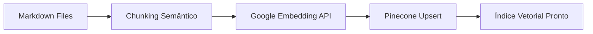
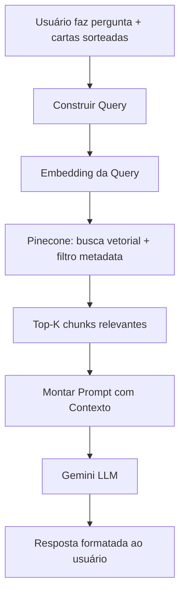

# Mystica — Arquitetura SaaS de Tarot com IA

## Visão Geral

Mystica é um SaaS de leituras de tarot potencializado por IA, usando **RAG (Retrieval-Augmented Generation)** para fornecer interpretações profundas e contextualizadas. A arquitetura é **100% serverless**, otimizada para custo zero/baixo em fase inicial.

---

## Stack Proposta

| Camada | Tecnologia | Justificativa |
|---|---|---|
| **Frontend** | Next.js 14+ (App Router) | SSR/SSG, API Routes serverless, deploy nativo Vercel |
| **Hosting/Deploy** | Vercel | Edge functions, preview deploys, CI/CD automático |
| **LLM** | Google Gemini (via API) | Custo competitivo, contexto grande (1M tokens), multimodal |
| **Vector DB** | Pinecone (Starter/Free) | Managed, serverless, integração fácil com embeddings |
| **Embeddings** | `text-embedding-004` (Google) | Embeddings de alta qualidade, barato |
| **Auth** | Clerk ou NextAuth.js | Autenticação pronta, social login, gestão de sessão |
| **Database** | Supabase (PostgreSQL) ou PlanetScale | Dados do usuário, histórico, assinaturas |
| **Pagamento** | Stripe ou Mercado Pago | Assinaturas recorrentes, webhooks |
| **Storage** | Vercel Blob ou Supabase Storage | Imagens de cartas, assets |
| **Analytics** | Vercel Analytics + PostHog | Métricas de uso, funis de conversão |

---

## Arquitetura de Conhecimento (RAG Pipeline)

### 1. Base de Conhecimento do Tarot

O coração do Mystica é um **corpus rico de conhecimento esotérico** indexado no Pinecone. O conteúdo deve ser curado e estruturado:

```
knowledge/
├── arcanos-maiores/          # 22 cartas
│   ├── o-louco.md
│   ├── o-mago.md
│   └── ...
├── arcanos-menores/          # 56 cartas (4 naipes × 14)
│   ├── copas/
│   ├── espadas/
│   ├── ouros/
│   └── paus/
├── spreads/                  # Tipos de tiragem
│   ├── cruz-celta.md
│   ├── tres-cartas.md
│   ├── horseshoe.md
│   └── ...
├── simbolismo/               # Conhecimento transversal
│   ├── numerologia.md
│   ├── astrologia-tarot.md
│   ├── elementos.md
│   ├── cabala-tarot.md
│   └── cores-simbolos.md
├── combinacoes/              # Interações entre cartas
│   ├── pares-classicos.md
│   └── tensoes-harmonias.md
└── contextos/                # Áreas de vida
    ├── amor.md
    ├── carreira.md
    ├── saude.md
    └── espiritualidade.md
```

#### Conteúdo por carta (exemplo):
Cada carta deve conter:
- **Significado na posição normal** (detalhado, com nuances)
- **Significado invertida** (se o sistema suportar)
- **Palavras-chave** e arquétipos
- **Correspondências** (planeta, signo, elemento, número)
- **Contextos específicos** (amor, trabalho, saúde, espiritual)
- **Conselhos práticos** associados
- **Combinações notáveis** com outras cartas

### 2. Pipeline de Ingestão (Indexação)



**Script de ingestão** (`scripts/ingest.ts`):
1. Lê os arquivos `.md` da base de conhecimento
2. Faz **chunking semântico** (por seção, ~500-800 tokens por chunk)
3. Adiciona **metadata** a cada chunk (carta, naipe, tipo, contexto)
4. Gera embeddings via `text-embedding-004`
5. Faz upsert no Pinecone com metadata filtráveis

> [!TIP]
> A metadata é crucial! Permite filtrar no Pinecone por carta específica, naipe, ou contexto, melhorando a precisão do RAG.

### 3. Pipeline de Consulta (Runtime)



**Fluxo detalhado:**
1. Usuário escolhe uma **tiragem** (3 cartas, Cruz Celta, etc.)
2. Sistema sorteia cartas aleatoriamente (ou o usuário escolhe)
3. Query é construída com: cartas sorteadas + posições + pergunta do usuário
4. Embedding da query busca chunks relevantes no Pinecone
5. **Filtro de metadata**: prioriza chunks das cartas específicas sorteadas
6. Prompt montado com contexto RAG + instruções de persona + histórico do usuário
7. Gemini gera a interpretação final

---

## Funcionalidades do Produto

### MVP (v1)
- [ ] **Tiragem de 3 cartas** (passado, presente, futuro)
- [ ] **Tiragem livre** (uma carta por dia / "carta do dia")
- [ ] **Pergunta personalizada** com interpretação contextualizada
- [ ] **Histórico de leituras** do usuário
- [ ] **Autenticação** (Google, email)
- [ ] Plano gratuito (X leituras/mês) + plano pago

### v2 (Expansão)
- [ ] Cruz Celta e outras tiragens complexas
- [ ] **Chat contínuo** sobre a leitura (follow-up questions)
- [ ] **Jornada espiritual** — tracking de temas recorrentes nas leituras
- [ ] Notificações diárias ("carta do dia")
- [ ] Compartilhamento de leituras (social)

### v3 (Premium)
- [ ] **Astrologia integrada** — mapa astral + tarot
- [ ] **Meditações guiadas** baseadas na carta
- [ ] Comunidade / fórum
- [ ] API pública para integrações

---

## Estrutura do Projeto

```
mystica/
├── src/
│   ├── app/                    # Next.js App Router
│   │   ├── (auth)/             # Rotas autenticadas
│   │   │   ├── reading/        # Página de leitura
│   │   │   ├── history/        # Histórico
│   │   │   └── profile/        # Perfil
│   │   ├── api/                # API Routes (serverless)
│   │   │   ├── reading/        # POST: gerar leitura
│   │   │   ├── cards/          # GET: info das cartas
│   │   │   └── webhooks/       # Pagamento webhooks
│   │   ├── layout.tsx
│   │   └── page.tsx            # Landing page
│   ├── lib/
│   │   ├── pinecone.ts         # Cliente Pinecone
│   │   ├── gemini.ts           # Cliente Gemini
│   │   ├── embeddings.ts       # Gerar embeddings
│   │   ├── rag.ts              # Pipeline RAG completo
│   │   ├── tarot.ts            # Lógica do tarot (baralho, sorteio)
│   │   └── prompts.ts          # Templates de prompt
│   ├── components/
│   │   ├── CardDeck.tsx        # Visualização do baralho
│   │   ├── CardReveal.tsx      # Animação de revelar carta
│   │   ├── ReadingResult.tsx   # Exibir resultado da leitura
│   │   └── SpreadLayout.tsx    # Layout da tiragem
│   └── data/
│       └── cards.json          # Dados estáticos das 78 cartas
├── knowledge/                  # Base de conhecimento (RAG source)
│   ├── arcanos-maiores/
│   ├── arcanos-menores/
│   └── ...
├── scripts/
│   ├── ingest.ts               # Script de ingestão no Pinecone
│   └── seed-cards.ts           # Popular dados iniciais
├── public/
│   └── cards/                  # Imagens das 78 cartas
└── package.json
```

---

## Prompt Engineering

A qualidade das leituras depende fortemente do **system prompt**. Exemplo de estrutura:

```
Você é Mystica, uma taróloga experiente e intuitiva com décadas de prática.

REGRAS:
- Use o conhecimento fornecido como BASE, mas adicione sua intuição
- Conecte as cartas entre si, mostrando a narrativa da tiragem
- Seja empática mas honesta — não suavize mensagens difíceis
- Adapte a linguagem ao contexto da pergunta do usuário
- Termine com um conselho acionável

TIRAGEM: {spread_type}
POSIÇÕES E CARTAS: {cards_with_positions}
PERGUNTA DO USUÁRIO: {user_question}

CONHECIMENTO RELEVANTE:
{rag_context}

Faça a leitura completa:
```

> [!IMPORTANT]
> O prompt deve ser iterado constantemente. Criar um sistema de **A/B testing** de prompts para medir satisfação do usuário é altamente recomendado.

---

## Custos Estimados (Fase Inicial)

| Serviço | Plano | Custo/mês |
|---|---|---|
| Vercel | Hobby (grátis) → Pro ($20) | $0–20 |
| Pinecone | Starter (grátis, 1 índice) | $0 |
| Gemini API | Pay-as-you-go | ~$5–30 (depende do uso) |
| Supabase | Free tier | $0 |
| Clerk | Free tier (10k MAU) | $0 |
| **Total estimado** | | **$5–50/mês** |

> [!NOTE]
> Com o free tier de praticamente todos os serviços, é possível rodar o MVP com custo quase zero até ter tração.

---

## Considerações Técnicas

### Performance
- **Streaming de resposta**: usar `ReadableStream` para enviar a resposta do Gemini em tempo real (efeito de "digitando")
- **Cache**: cachear embeddings de queries comuns e resultados de RAG frequentes
- **Edge Functions**: rodar o máximo possível no edge (Vercel) para baixa latência

### Segurança
- Rate limiting nas API routes (evitar abuso do Gemini)
- Validação de input (sanitizar perguntas do usuário)
- Tokens JWT para autenticação
- Webhook signature verification (pagamentos)

### Escalabilidade
- Pinecone escala automaticamente
- Vercel serverless escala sob demanda
- Supabase tem connection pooling built-in
- Considerar **queue** (Vercel KV ou Upstash Redis) se volume crescer

---

## Próximos Passos

1. **Definir o escopo do MVP** — quais tiragens e funcionalidades priorizar
2. **Curar a base de conhecimento** — escrever/compilar o conteúdo sobre as 78 cartas
3. **Inicializar o projeto** Next.js na Vercel
4. **Implementar o pipeline RAG** (ingestão → consulta)
5. **Criar a UI** com animações de cartas
6. **Integrar pagamentos** e limites de uso

> [!CAUTION]
> A qualidade do produto depende **diretamente** da qualidade da base de conhecimento. Investir tempo na curadoria do conteúdo esotérico é tão importante quanto o código.
